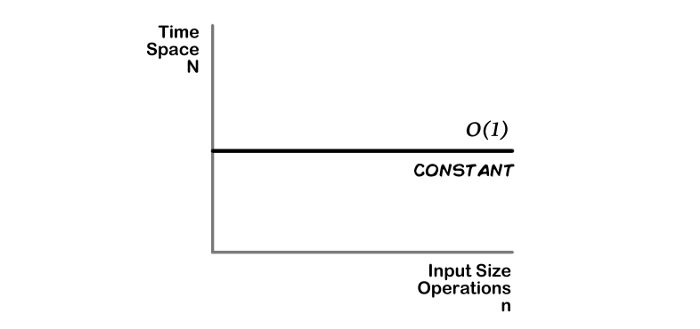
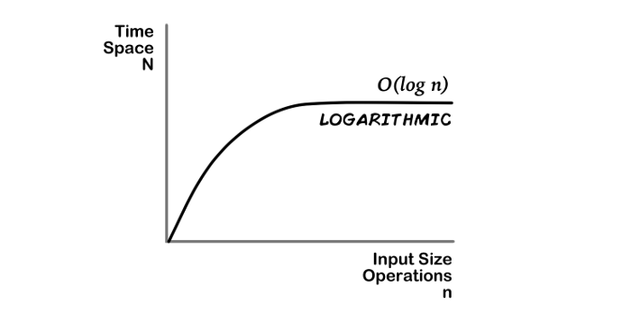
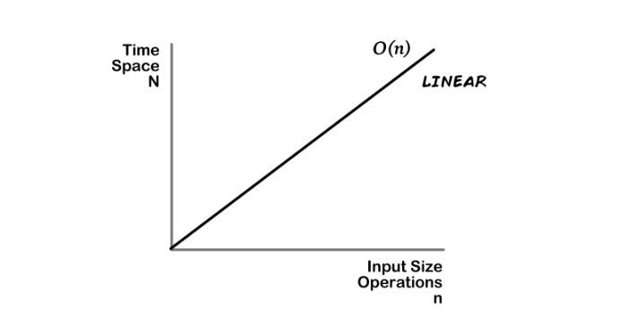
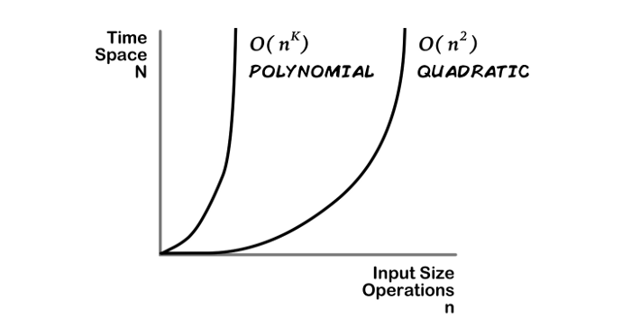
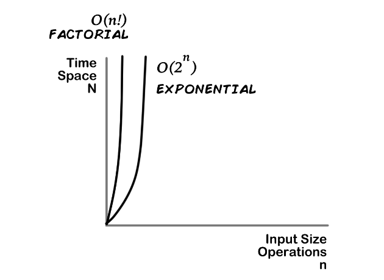
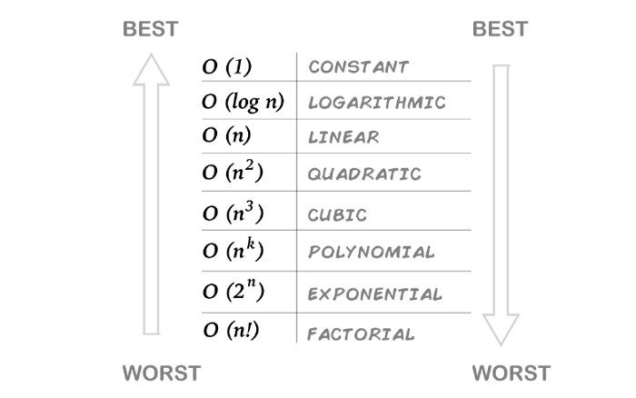
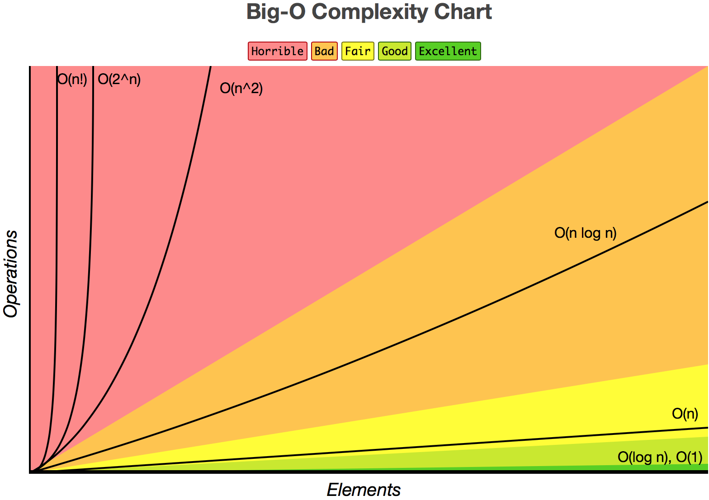
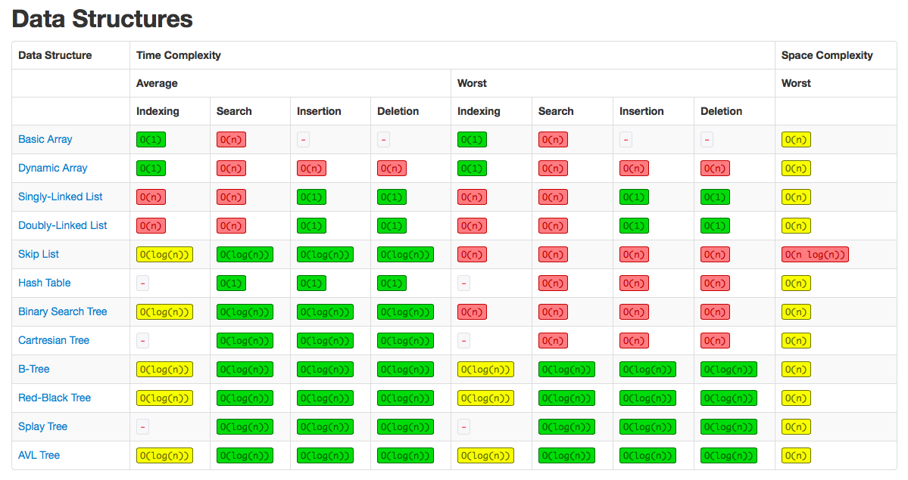
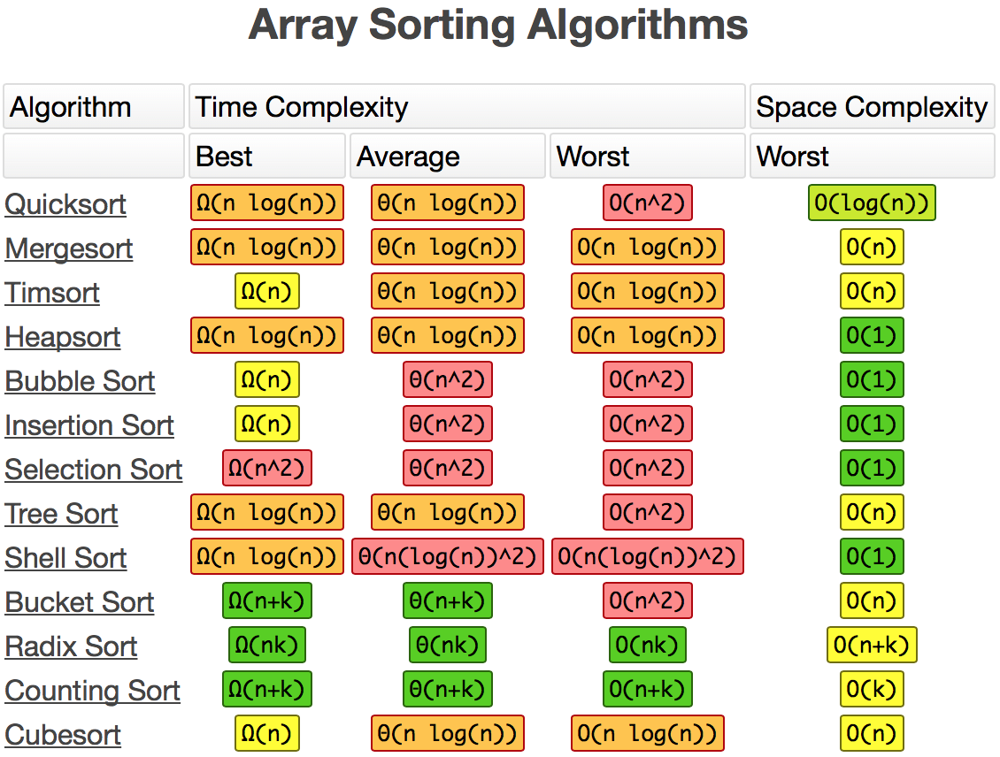

# Time and Space Complexity [1](https://levelup.gitconnected.com/time-and-space-complexity-725dcba31902)

## Time ( and Space ) is Money

__How long will our code take to run, how much space will the solution use__

## Complexity

Time and space complexity helps us compare and generalize.

##### Left side of our complexity equation:

 
> "Time complexity is commonly estimated by counting the number of elementary 
operations performed by the algorithm, supposing that each elementary 
operation takes a fixed amount of time to perform." - Wikipedia

## Behavior, Relationships, and Operations

##### Right side of our complexity equation:

Time and Space Complexity at this level describe the relationship between 
Inputs and rate of operations/space taken. You still need to find the specific 
inputs, operations and space units.

## Behavior and O Notation ( aka Big O Notation )

O notation is a mathematical convention that is used to describe these 
relationships.

> "Big O notation is a mathematical notation that describes the limiting 
behavior of a function when the argument tends towards a particular value or 
infinity." - Wiki

## Common O Notations or Complexity Types:

### Most common complexities:

#### 1. CONSTANT complexity:
O(1) - it takes at most the same amount of time or space for one or many

#### 2. LOGARITHMIC complexity:
O(log n) - increases at first but then it stabilizes and changes less

#### 3. LINEAR complexity:
O(n) - increases at worst at a fixed/liner rate

#### 4. QUADRATIC & POLYNOMIAL complexity:
O(n^2) & O(n^k) - as your inputs increase your, time becomes greater at a 
certain greater rate which is related to the exponent, ^2 for quadratics, 
^k for Polynomials

#### 5. EXPONENTIAL & FACTORIAL complexity:
O(2^n) & O(n!) - rapidly increases until time and space requirements tend 
towards the infinite

#### Complexity Summary:

#### Big-O Complexity Chart:

#### Data Structures Complexity:

#### Sorting Arrays Complexity:

#### Big-O Cheat Sheet:

[Complexity Cheat Sheet](../Images/big O cheat sheet.png)

### Other materials:
[Wiki time complexity](https://en.wikipedia.org/wiki/Time_complexity)

[Wiki computational complexity](https://en.wikipedia.org/wiki/Computational_complexity_of_mathematical_operations)

### References:
[Time and Space Complexity](https://levelup.gitconnected.com/time-and-space-complexity-725dcba31902) 

