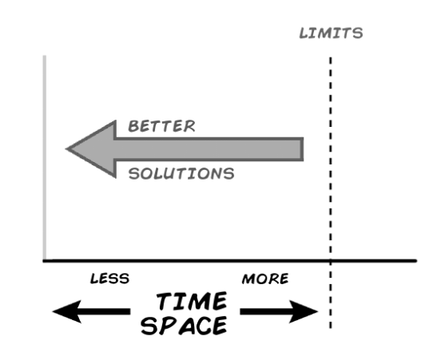
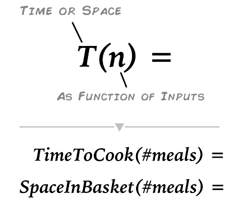
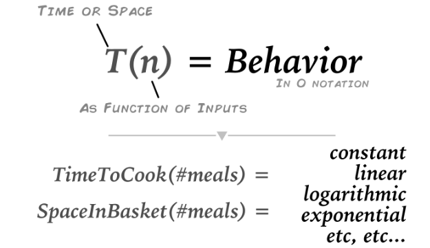

# Time and Space Complexity [1](https://levelup.gitconnected.com/time-and-space-complexity-725dcba31902)

## Time ( and Space ) is Money

__How long will our code take to run, how much space will the solution use__

## Complexity

Let’s say you are cooking dinner and go shopping. How much time will it take 
to cook and how much space in your shopping cart will it require?

It depends on what you are cooking and other factors like what equipment you 
have at home and how many people you want to serve.

Serving one or five, the beef stew takes a little more space in the shopping 
basket and the same time to cook, whereas the Ramen noodles have a different 
relationship, each additional Ramen dinner takes one extra space in the basket 
and 3 more minutes to make.

Time and space complexity helps us compare and generalize these type of 
situations.

 
> "Time complexity is commonly estimated by counting the number of elementary 
operations performed by the algorithm, supposing that each elementary 
operation takes a fixed amount of time to perform." - Wikipedia

## Behavior, Relationships, and Operations

### References:
[1]: (https://levelup.gitconnected.com/time-and-space-complexity-725dcba31902) "Time and Space Complexity"

